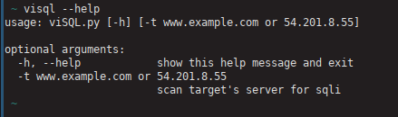
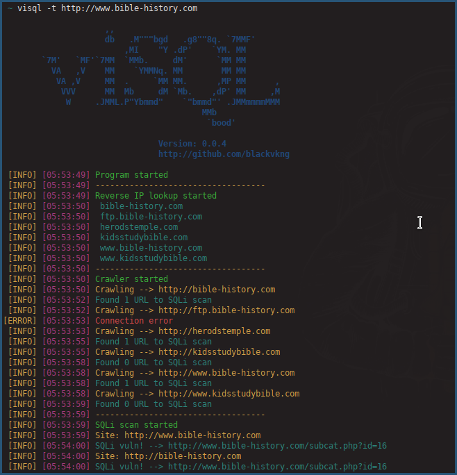

# viSQL
Scan SQL vulnerability on target site and sites of on server.

#### Pre-installed System(s)


# Installation

### Automatic Installation

```
~$ wget https://raw.githubusercontent.com/blackvkng/viSQL/master/installer.py
~$ sudo python2 installer.py
~$ # Type "visql" to use tool.
~$ visql
```

### Manual Installation

```
~$ git clone https://github.com/blackvkng/viSQL.git
~$ cd viSQL
~$ python2 viSQL.py --help
```

# Usage



# Screenshot


#### Asciinema
[](https://asciinema.org/a/124271?autoplay=1)
